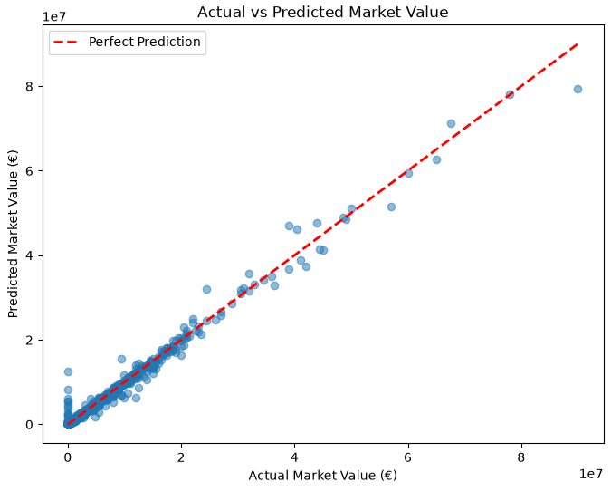
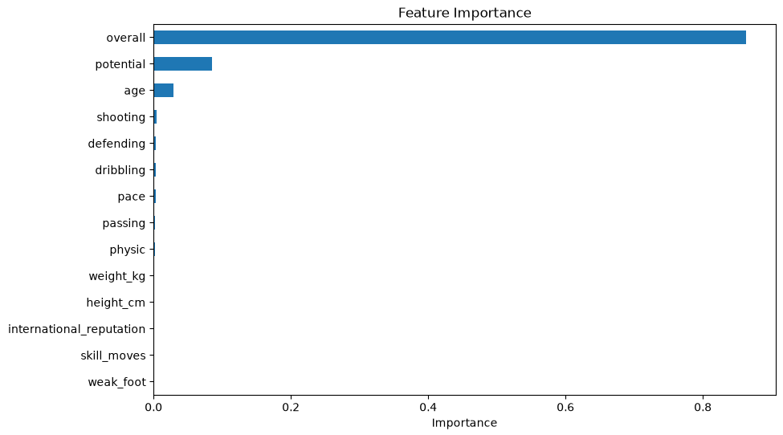
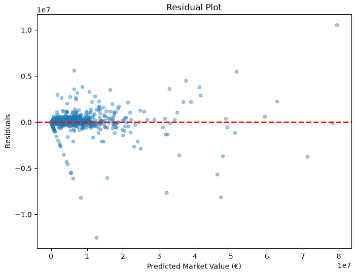

# Football Player Market Value Prediction using Random Forest Regression

## Overview

This project predicts football players market values using a Random Forest Regression model. The model was trained on FIFA player data after applying data preprocessing, feature selection, and hyperparameter tuning. Different numbers of decision trees were evaluated to identify the best-performing model.

---

## Dataset

Dataset Source:

https://www.kaggle.com/datasets/thedevastator/footballpriceprediction

### Dataset Summary

| Property | Value |
|----------|------:|
| Original Rows | 18,945 |
| Rows After Preprocessing | 16,861 |
| Selected Features | 14 |
| Target Variable | value_eur |

---
## Project Structure

```text
├── Data/
│   └── football_players.csv
├── Images/


---

## Features Used

The following numerical features were selected:

- age
- overall
- potential
- height_cm
- weight_kg
- weak_foot
- skill_moves
- international_reputation
- pace
- shooting
- passing
- dribbling
- defending
- physic

Target:

- value_eur

---

## Data Preprocessing

The following preprocessing steps were applied:

- Selected only relevant numerical features.
- Removed rows containing missing values.
- Split the dataset into training and testing sets (80% / 20%).

---

## Model

Random Forest Regression

Final Parameters

| Parameter | Value |
|-----------|------:|
| n_estimators | 300 |
| random_state | 42 |

---

## Hyperparameter Comparison

Several values of `n_estimators` were evaluated.

| Trees | R² Score | MAE | RMSE |
|------:|---------:|------------:|------------:|
| 10 | 0.984191 | 150,649.42 | 669,794.14 |
| 100 | 0.986909 | 136,935.41 | 609,523.61 |
| 200 | 0.987470 | 135,557.55 | 596,301.57 |
| **300** | **0.987713** | **134,716.99** | **590,496.91** |
| 500 | 0.987561 | 134,317.84 | 594,148.20 |

The model achieved its best overall performance using **300 decision trees**, providing the highest R² score while maintaining a lower prediction error compared to the other configurations.

---

## Model Performance

| Metric | Value |
|--------|-------:|
| R² Score | **0.987713** |
| MAE | **134,716.99** |
| RMSE | **590,496.91** |

---

## Visualizations

### Actual vs Predicted

The scatter plot shows a strong agreement between the actual and predicted market values. Most predictions lie close to the perfect prediction line, indicating excellent model performance.

<p align="center">

</p>

---

### Feature Importance

Feature importance analysis shows which variables contributed the most to predicting player market value.

<p align="center">

</p>

---

### Residual Plot

Residuals are randomly distributed around zero with no strong systematic pattern, suggesting that the Random Forest model captures the relationship between the selected features and player value effectively.

<p align="center">

</p>

---

## Key Insights

- The player's **overall rating** is by far the strongest predictor of market value.
- **Potential** is the second most influential featur indicating that future player development significantly affects valuation.
- Technical attributes such as shooting, passing, dribbling and defending contribute to the prediction, although their impact is much smaller than overall rating.
- Increasing the number of trees improved the model performance up to **300 trees**.
- Increasing the forest size beyond **300 trees** produced only marginal improvements while increasing training time.

---

## Technologies Used

- Python
- Pandas
- NumPy
- Matplotlib
- Scikit-learn

---

## Conclusion

Random Forest Regression achieved excellent predictive performance with an R² score of **0.9877**.

The results indicate that player ratings, particularly **overall** and **potential**, play the most significant role in determining market value. Hyperparameter tuning showed that using **300 decision trees** provides the best balance between predictive performance and computational cost for this dataset.
